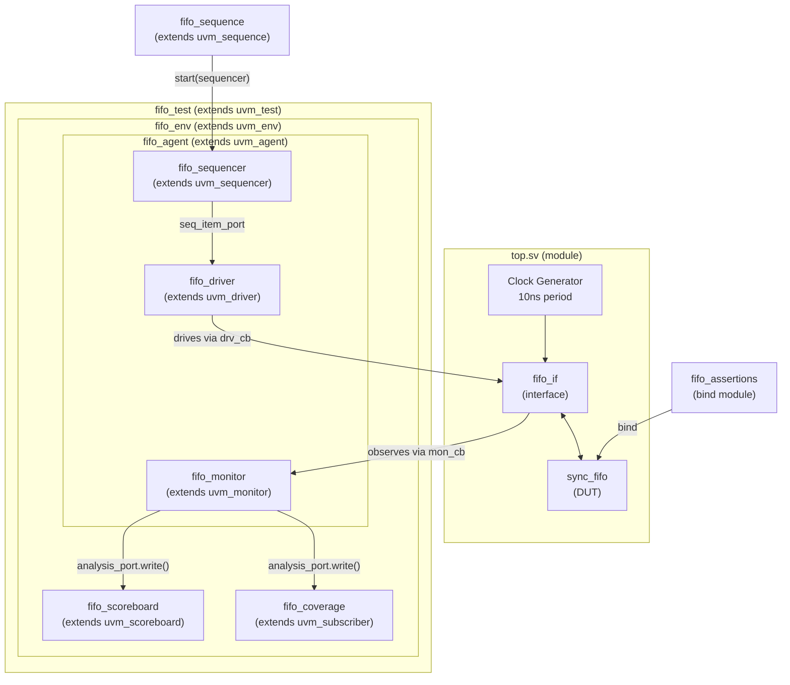

# 📋 Synchronous FIFO — Verification Plan & Test Plan (UVM)

| Field | Value |
|-------|-------|
| **Design Name** | `sync_fifo` |
| **Author** | — |
| **Date Created** | 2026-09-17 |
| **Last Updated** | 2026-09-17 |
| **Version** | 1.0 |
| **Status** | Draft |
| **Tools** | Questa 2021.2 (primary), iverilog + GTKWave (backup) |
| **Methodology** | UVM (Universal Verification Methodology) |
| **Language** | SystemVerilog (IEEE 1800-2017) |

---

## 1. DUT Overview

### 1.1 Description

The DUT is a **synchronous FIFO** (First-In-First-Out) buffer operating in a single clock domain. It stores up to 32 words of 8-bit data using a register-file memory array. Full/empty status is tracked via a **counter-based** approach (as opposed to the extra-pointer-bit method). The FIFO is used to decouple producer/consumer timing — a producer writes data in bursts, the consumer reads at its own pace, and the FIFO absorbs the difference.

### 1.2 Block Diagram

```
                    ┌──────────────────────────────────┐
                    │          sync_fifo                │
     clk ──────────▶│                                  │
     rst_n ─────────▶│  ┌────────────────────────────┐ │
                    │  │  mem[0:31]  (8-bit × 32)    │ │
     wr_en ─────────▶│  │                            │ │
     data_in[7:0] ──▶│  │   wr_ptr ──▶ [write side]  │──▶ full
                    │  │                            │ │
     rd_en ─────────▶│  │   rd_ptr ──▶ [read side]   │──▶ empty
                    │  │                            │──▶ data_out[7:0]
                    │  │   count ──▶ [status logic]  │ │
                    │  └────────────────────────────┘ │
                    └──────────────────────────────────┘
```

### 1.3 Port List

| Port | Direction | Width | Description |
|------|-----------|-------|-------------|
| `clk` | input | 1 | System clock (100 MHz, 10ns period) |
| `rst_n` | input | 1 | Active-low synchronous reset |
| `wr_en` | input | 1 | Write enable — stores `data_in` when `!full` |
| `rd_en` | input | 1 | Read enable — outputs next word when `!empty` |
| `data_in` | input | 8 | Write data |
| `data_out` | output | 8 | Read data (**registered** — updates 1 cycle after `rd_en`) |
| `full` | output | 1 | High when `count == DEPTH` (**combinational**) |
| `empty` | output | 1 | High when `count == 0` (**combinational**) |

### 1.4 Parameters

| Parameter | Type | Default | Description |
|-----------|------|---------|-------------|
| `DATA_WIDTH` | int | 8 | Bit-width of each FIFO word |
| `DEPTH` | int | 32 | Number of entries in the FIFO |

### 1.5 Internal Signals (from RTL analysis)

| Signal | Width | Description |
|--------|-------|-------------|
| `mem[0:DEPTH-1]` | DATA_WIDTH × DEPTH | Register-file memory array |
| `wr_ptr` | `$clog2(DEPTH)` = 5 bits | Write pointer (wraps at DEPTH-1 → 0 via natural overflow) |
| `rd_ptr` | `$clog2(DEPTH)` = 5 bits | Read pointer (same wrap behavior) |
| `count` | `$clog2(DEPTH)+1` = 6 bits | Occupancy counter (0 to DEPTH) |

### 1.6 Design Decisions & Verification Implications

| # | Design Decision | RTL Evidence | Verification Implication |
|---|----------------|-------------|--------------------------|
| D1 | **Synchronous reset** (not async) | `always_ff @(posedge clk) if (!rst_n)` | Reset only takes effect at next `posedge clk`. Driver must hold `rst_n=0` for multiple cycles. |
| D2 | **Writes gated by `!full`** | `wr_en && !full` on line 37 | Overflow is silently ignored — no error flag. Must verify data isn't corrupted. |
| D3 | **Reads gated by `!empty`** | `rd_en && !empty` on line 48 | Underflow is silently ignored. `data_out` holds its last value. |
| D4 | **`data_out` is registered** | Inside `always_ff`, updates on `posedge clk` | Output appears **1 cycle after** `rd_en`. Monitor must sample `data_out` with this latency. |
| D5 | **`full`/`empty` are combinational** | `assign full = (count == DEPTH)` | Flags update **same cycle** as count changes. No 1-cycle delay on flags. |
| D6 | **Simultaneous R/W: count unchanged** | `2'b11: count <= count` on line 63 | When both R+W valid: one word in, one word out, net zero change. |
| D7 | **Counter-based full/empty** | `count` register, not extra pointer bit | Simpler to verify — count is directly observable. |
| D8 | **Pointer wrap via natural overflow** | `wr_ptr` is 5 bits, wraps 31→0 automatically | Works because DEPTH=32 is a power of 2. **Would break for non-power-of-2 depths.** |
| D9 | **Memory not cleared on reset** | Only pointers and count reset, not `mem[]` | Old data remains in memory after reset, but is inaccessible (pointers reset). Not a bug, but worth knowing. |

---

## 2. Feature Extraction Matrix

| ID | Feature | Description | Verified By | Priority |
|----|---------|-------------|-------------|----------|
| F01 | Reset behavior | `rst_n=0`: `wr_ptr=0`, `rd_ptr=0`, `count=0`, `data_out=0`, `empty=1`, `full=0` | T01, A01 | P0 |
| F02 | Single write | `wr_en=1 && !full` stores `data_in` at `mem[wr_ptr]`, increments `wr_ptr` | T02, T09 | P0 |
| F03 | Single read | `rd_en=1 && !empty` outputs `mem[rd_ptr]` to `data_out` (next cycle), increments `rd_ptr` | T02, T09 | P0 |
| F04 | Full flag assertion | `full` goes high when `count` reaches `DEPTH` (32) | T03, A02, cp_full | P0 |
| F05 | Empty flag assertion | `empty` goes high when `count` reaches 0 | T04, A03, cp_empty | P0 |
| F06 | Overflow protection | Write when `full=1` is silently ignored — no corruption of stored data or pointers | T06, A04 | P0 |
| F07 | Underflow protection | Read when `empty=1` is silently ignored — `data_out` holds last value | T07, A05 | P0 |
| F08 | FIFO ordering (FIFO property) | Data read out in exact same order as written in | T08, scoreboard | P0 |
| F09 | Simultaneous R/W | `wr_en=1 && rd_en=1` when neither full nor empty: both execute, count unchanged | T05, cx_wr_rd | P1 |
| F10 | Pointer wrap-around | `wr_ptr`/`rd_ptr` correctly wrap from 31→0 after sustained operation | T10, A06 | P1 |
| F11 | Full/empty mutual exclusion | `full` and `empty` are never both 1 simultaneously | A07 | P0 |
| F12 | Stress robustness | No failures under 1000+ random constrained transactions | T09, coverage | P2 |

---

## 3. Verification Architecture (UVM)

### 3.1 UVM Testbench Block Diagram



### 3.2 UVM vs Class-Based OOP — Key Differences

| Concept | Class-Based (what the challenge doc uses) | UVM (what this plan targets) |
|---------|------------------------------------------|------------------------------|
| Transaction | `class fifo_transaction` | `class fifo_seq_item extends uvm_sequence_item` |
| Stimulus generation | `fifo_generator` + `mailbox` | `fifo_sequence extends uvm_sequence` + `fifo_sequencer` |
| Driving DUT | `fifo_driver` + manual `mailbox.get()` | `fifo_driver extends uvm_driver` + `seq_item_port.get_next_item()` |
| Monitoring | `fifo_monitor` + `mailbox.put()` | `fifo_monitor extends uvm_monitor` + `uvm_analysis_port` |
| Checking | `fifo_scoreboard` + `mailbox.get()` | `fifo_scoreboard extends uvm_scoreboard` + `uvm_tlm_analysis_fifo` |
| Coverage | manual class | `fifo_coverage extends uvm_subscriber` |
| Wiring | manual in environment constructor | `uvm_config_db`, TLM `connect()` in `connect_phase` |
| Test selection | `ifdef` or manual | `+UVM_TESTNAME=fifo_test_fill` on command line |
| Reporting | `$display`, `$error` | `uvm_info`, `uvm_error`, `uvm_fatal` |
| Phases | manual `task run()` | `build_phase`, `connect_phase`, `run_phase`, `report_phase` |

### 3.3 Component Responsibilities

| Component | File | UVM Base Class | Responsibility |
|-----------|------|----------------|----------------|
| Interface | `fifo_if.sv` | *(not a class)* | Bundles signals, clocking blocks (`drv_cb`, `mon_cb`), modports (`DRV`, `MON`) |
| Sequence Item | `fifo_seq_item.sv` | `uvm_sequence_item` | One atomic transaction: `rand` fields (`wr_en`, `rd_en`, `data_in`) + DUT outputs (`data_out`, `full`, `empty`) |
| Sequence | `fifo_sequence.sv` | `uvm_sequence` | Generates N randomized seq_items, sends to sequencer via `start_item()`/`finish_item()` |
| Sequencer | `fifo_sequencer.sv` | `uvm_sequencer` | Arbitrates between sequences, passes items to driver (mostly boilerplate) |
| Driver | `fifo_driver.sv` | `uvm_driver` | Gets seq_items via `seq_item_port`, drives DUT pins through `drv_cb`, handles reset |
| Monitor | `fifo_monitor.sv` | `uvm_monitor` | Passively samples all signals via `mon_cb`, broadcasts via `uvm_analysis_port` |
| Scoreboard | `fifo_scoreboard.sv` | `uvm_scoreboard` | Receives from monitor via `uvm_tlm_analysis_fifo`, maintains reference queue `[$]`, compares on every read |
| Coverage | `fifo_coverage.sv` | `uvm_subscriber` | Receives from monitor, samples covergroup on every transaction |
| Agent | `fifo_agent.sv` | `uvm_agent` | Bundles sequencer + driver + monitor, supports `UVM_ACTIVE`/`UVM_PASSIVE` mode |
| Environment | `fifo_env.sv` | `uvm_env` | Instantiates agent + scoreboard + coverage, connects TLM ports |
| Test | `fifo_test.sv` | `uvm_test` | Creates environment, selects/starts sequence, configures parameters |
| Assertions | `fifo_assertions.sv` | *(module, not class)* | SVA concurrent properties, bound to DUT via `bind` |
| Package | `fifo_pkg.sv` | — | Bundles all class `include`s, `import uvm_pkg::*` |
| Top | `top.sv` | *(module)* | Clock gen, DUT + interface instantiation, `run_test()` call |

### 3.4 File Hierarchy

```
SYNC_FIFO/
├── sync_fifo.sv              ✅ RTL (DUT) — DONE
├── fifo_if.sv                🟡 Interface — written, has bugs
│
│   ── UVM Testbench Classes ──
├── fifo_seq_item.sv          ❌ Sequence item (replaces fifo_transaction)
├── fifo_sequence.sv          ❌ Sequences (replaces fifo_generator)
├── fifo_sequencer.sv         ❌ Sequencer (thin wrapper, mostly typedef)
├── fifo_driver.sv            ❌ UVM driver
├── fifo_monitor.sv           ❌ UVM monitor
├── fifo_agent.sv             ❌ UVM agent (bundles drv + mon + seqr)
├── fifo_scoreboard.sv        ❌ UVM scoreboard + reference model
├── fifo_coverage.sv          ❌ UVM subscriber + covergroup
├── fifo_env.sv               ❌ UVM environment
├── fifo_test.sv              ❌ UVM test(s) — one class per test scenario
│
│   ── Assertions ──
├── fifo_assertions.sv        ❌ SVA bind module
│
│   ── Infrastructure ──
├── fifo_pkg.sv               ❌ Package (import uvm_pkg, include all classes)
├── top.sv                    ❌ Top module (clock, DUT, interface, run_test)
├── Makefile                  ❌ Compile & run (Questa UVM flow)
└── README.md                 ❌ Documentation
```

**Total: 16 files** (1 done, 1 with bugs, 14 to create)

### 3.5 Compile Order

```bash
# UVM compile order (Questa)
vlog +incdir+$UVM_HOME/src $UVM_HOME/src/uvm_pkg.sv    # 1. UVM library
vlog fifo_pkg.sv                                        # 2. Package (includes all classes)
vlog fifo_if.sv                                         # 3. Interface
vlog sync_fifo.sv                                       # 4. DUT
vlog fifo_assertions.sv                                 # 5. SVA bind module
vlog top.sv                                             # 6. Top module

# Run with test selection
vsim -c top +UVM_TESTNAME=fifo_test_random -do "run -all; quit"
```

### 3.6 `fifo_pkg.sv` Include Order

```systemverilog
package fifo_pkg;
  import uvm_pkg::*;
  `include "uvm_macros.svh"

  `include "fifo_seq_item.sv"      // 1. transaction (no dependencies)
  `include "fifo_sequence.sv"      // 2. sequences (depends on seq_item)
  `include "fifo_sequencer.sv"     // 3. sequencer (depends on seq_item)
  `include "fifo_driver.sv"        // 4. driver (depends on seq_item)
  `include "fifo_monitor.sv"       // 5. monitor (depends on seq_item)
  `include "fifo_agent.sv"         // 6. agent (depends on drv + mon + seqr)
  `include "fifo_scoreboard.sv"    // 7. scoreboard (depends on seq_item)
  `include "fifo_coverage.sv"      // 8. coverage (depends on seq_item)
  `include "fifo_env.sv"           // 9. env (depends on agent + scb + cov)
  `include "fifo_test.sv"          // 10. test (depends on env + sequences)
endpackage
```

---

## 4. Coverage Plan

### 4.1 Functional Coverage

| Covergroup | Coverpoint / Cross | Bins | Description | Target |
|------------|-------------------|------|-------------|--------|
| `fifo_cg` | `cp_wr_en` | `{0}`, `{1}` | Write enable toggle | 100% |
| | `cp_rd_en` | `{0}`, `{1}` | Read enable toggle | 100% |
| | `cx_wr_rd` | cross `cp_wr_en × cp_rd_en` | All 4 combos: (0,0) (0,1) (1,0) (1,1) | 100% |
| | `cp_full` | `{0}`, `{1}` | Full flag both states | 100% |
| | `cp_empty` | `{0}`, `{1}` | Empty flag both states | 100% |
| | `cx_wr_full` | cross `cp_wr_en × cp_full` | Catches write-when-full scenario | 100% |
| | `cx_rd_empty` | cross `cp_rd_en × cp_empty` | Catches read-when-empty scenario | 100% |
| | `cp_data_in` | `zero={0}`, `low={[1:127]}`, `high={[128:254]}`, `max={255}` | Data value distribution | 100% |
| | `cp_occupancy` | `empty_={0}`, `low_={[1:8]}`, `mid_={[9:16]}`, `high_={[17:24]}`, `near_full_={[25:31]}`, `full_={32}` | FIFO fill levels | >95% |

### 4.2 Transition Coverage (Advanced)

| Coverpoint | Transitions | Description |
|-----------|-------------|-------------|
| `cp_full_trans` | `0 => 1`, `1 => 0` | Full flag rising and falling edges |
| `cp_empty_trans` | `0 => 1`, `1 => 0` | Empty flag rising and falling edges |
| `cp_occupancy_trans` | `0 => 1` (first write), `31 => 32` (becomes full), `32 => 31` (leaves full), `1 => 0` (becomes empty) | Critical occupancy transitions |

### 4.3 Code Coverage Targets

| Metric | Target | Exclusions |
|--------|--------|------------|
| Line coverage | >95% | None expected |
| Branch coverage | >95% | `default` case in count logic (unreachable — all 4 cases covered) |
| Toggle coverage | >90% | Clock, reset |
| Expression coverage | >90% | `wr_en && !full`, `rd_en && !empty` — all truth table rows |

### 4.4 Coverage Closure Strategy

```
1. Run T09 (random_stress, 1000+ transactions) → generate initial coverage
2. Analyze coverage report:
   - `vcover report -details -annotate fifo_cov.ucdb`
3. Identify uncovered bins → map to directed tests:
   - cp_occupancy "full_" not hit? → run T03 (fill_to_full)
   - cx_wr_full (1,1) not hit? → run T06 (write_when_full)
4. Mark truly impossible bins as `ignore_bins` with justification
5. Re-run all tests → merge coverage → check ≥95%
```

---

## 5. Assertion Plan

| ID | Property Name | Type | SVA Description | Condition | Feature |
|----|--------------|------|-----------------|-----------|---------|
| A01 | `p_reset_state` | Concurrent | After reset de-asserts, FIFO must be in clean initial state | `$rose(rst_n) \|=> (empty && !full)` | F01 |
| A02 | `p_full_at_depth` | Concurrent | Full must be high if and only if count equals DEPTH | `(count == DEPTH) \|-> full` and `full \|-> (count == DEPTH)` | F04 |
| A03 | `p_empty_at_zero` | Concurrent | Empty must be high if and only if count equals 0 | `(count == 0) \|-> empty` and `empty \|-> (count == 0)` | F05 |
| A04 | `p_no_wr_ptr_change_when_full` | Concurrent | Write pointer must not change when FIFO is full | `full \|=> $stable(wr_ptr) \|\| !full` | F06 |
| A05 | `p_no_rd_ptr_change_when_empty` | Concurrent | Read pointer must not change when FIFO is empty | `empty \|=> $stable(rd_ptr) \|\| !empty` | F07 |
| A06 | `p_count_bounds` | Concurrent | Count must never exceed DEPTH or go negative | `count <= DEPTH` (always) | F10 |
| A07 | `p_full_empty_mutex` | Concurrent | Full and empty must never both be high | `!(full && empty)` (always) | F11 |

> [!NOTE]
> All concurrent assertions use `disable iff (!rst_n)` to suppress firing during reset.

### Bind Strategy

```systemverilog
// In fifo_assertions.sv — keeps assertions separate from RTL
module fifo_sva (
  input logic clk, rst_n,
  input logic wr_en, rd_en,
  input logic [7:0] data_in, data_out,
  input logic full, empty,
  input logic [4:0] wr_ptr, rd_ptr,
  input logic [5:0] count
);
  // All properties and assertions defined here
endmodule

// In top.sv — bind to DUT without modifying RTL:
bind sync_fifo fifo_sva sva_inst (.*);
```

---

## 6. Test Plan

### 6.1 Test Summary

| ID | Test Name | Pri | Type | Lens | Features |
|----|-----------|-----|------|------|----------|
| T01 | `test_reset` | P0 | Directed | Reset | F01 |
| T02 | `test_single_write_read` | P0 | Directed | Data | F02, F03, F08 |
| T03 | `test_fill_to_full` | P0 | Directed | Boundary | F02, F04 |
| T04 | `test_drain_to_empty` | P0 | Directed | Boundary | F03, F05 |
| T05 | `test_simultaneous_rw` | P1 | Directed | Adversarial | F09 |
| T06 | `test_write_when_full` | P0 | Directed | Adversarial | F06 |
| T07 | `test_read_when_empty` | P0 | Directed | Adversarial | F07 |
| T08 | `test_fifo_ordering` | P0 | Directed | Data | F08 |
| T09 | `test_random_stress` | P2 | Random | All | F12, all |
| T10 | `test_alternating_rw` | P1 | Directed | Temporal | F10 |

### 6.2 Detailed Test Specifications

---

#### T01 — `test_reset`

| Field | Detail |
|-------|--------|
| **Priority** | P0 |
| **Type** | Directed |
| **Lens** | Reset & Recovery |
| **Features** | F01 |
| **Prerequisite** | None (first test to run) |
| **Stimulus** | 1. Assert `rst_n = 0` for 5 clock cycles. 2. Release `rst_n = 1`. 3. Hold `wr_en=0`, `rd_en=0` throughout. |
| **Expected Behavior** | After `rst_n` rises: `empty=1`, `full=0`, `data_out=0`. Internal: `wr_ptr=0`, `rd_ptr=0`, `count=0`. |
| **Pass Criteria** | All output signals match expected on the first cycle after reset de-assertion. |
| **UVM Implementation** | Sequence sends 5 items with `rst_n=0`, then releases. Driver handles reset via `vif.rst_n <= 0`. |
| **Coverage Bins Hit** | `cp_empty{1}`, `cp_full{0}`, `cp_occupancy{empty_}` |

---

#### T02 — `test_single_write_read`

| Field | Detail |
|-------|--------|
| **Priority** | P0 |
| **Type** | Directed |
| **Lens** | Data Integrity |
| **Features** | F02, F03, F08 |
| **Prerequisite** | T01 (reset) |
| **Stimulus** | 1. Reset. 2. Write 1 word (`data_in=0xAB, wr_en=1, rd_en=0`). 3. Wait 1 cycle. 4. Read 1 word (`wr_en=0, rd_en=1`). 5. Wait 1 cycle (registered output). |
| **Expected Behavior** | `data_out = 0xAB` one cycle after `rd_en`. `empty` goes `1→0` on write, back to `1` after read. |
| **Pass Criteria** | Scoreboard: `data_out === 0xAB`. Flags: `empty=1` before write, `empty=0` after write, `empty=1` after read. |
| **UVM Implementation** | Directed sequence with inline constraints: `item.randomize() with { wr_en==1; rd_en==0; data_in==8'hAB; };` then `item.randomize() with { wr_en==0; rd_en==1; };` |
| **Coverage Bins Hit** | `cp_wr{1}`, `cp_rd{1}`, `cp_data_in{high}`, `cp_empty{0,1}`, `cp_occupancy{empty_, low_}` |

---

#### T03 — `test_fill_to_full`

| Field | Detail |
|-------|--------|
| **Priority** | P0 |
| **Type** | Directed |
| **Lens** | Boundary |
| **Features** | F02, F04 |
| **Prerequisite** | T01 |
| **Stimulus** | 1. Reset. 2. Write 32 words sequentially (`data_in = 0,1,2,...,31`), `rd_en=0` throughout. |
| **Expected Behavior** | After 32nd write: `full=1`, `empty=0`, `count=32`. `full` was `0` for writes 1-31. |
| **Pass Criteria** | `full === 1` after DEPTH writes. `empty === 0` throughout. No assertion violations. |
| **UVM Implementation** | Sequence with `repeat(32)` loop, inline constraint: `{ wr_en==1; rd_en==0; }`. Use incrementing `data_in` for later ordering checks. |
| **Coverage Bins Hit** | `cp_full{0,1}`, `cp_full_trans{0=>1}`, `cp_occupancy{all bins from empty_ to full_}` |

---

#### T04 — `test_drain_to_empty`

| Field | Detail |
|-------|--------|
| **Priority** | P0 |
| **Type** | Directed |
| **Lens** | Boundary |
| **Features** | F03, F05 |
| **Prerequisite** | T03 (FIFO must be full) |
| **Stimulus** | 1. Start from full FIFO (run T03 first). 2. Read 32 words, `wr_en=0` throughout. |
| **Expected Behavior** | After 32nd read: `empty=1`, `full=0`, `count=0`. Data read back: `0,1,2,...,31` (FIFO ordering from T03). |
| **Pass Criteria** | `empty === 1` after DEPTH reads. Scoreboard: all 32 data values match in order. |
| **UVM Implementation** | Chain sequence: `fifo_seq_fill` followed by `fifo_seq_drain`. Or single sequence with two phases. |
| **Coverage Bins Hit** | `cp_empty{0,1}`, `cp_empty_trans{0=>1}`, `cp_full_trans{1=>0}`, `cp_occupancy{full_ down to empty_}` |

---

#### T05 — `test_simultaneous_rw`

| Field | Detail |
|-------|--------|
| **Priority** | P1 |
| **Type** | Directed |
| **Lens** | Adversarial |
| **Features** | F09 |
| **Prerequisite** | T01 |
| **Stimulus** | 1. Reset. 2. Write 16 words to half-fill. 3. Drive `wr_en=1, rd_en=1` for 10 consecutive cycles with new data. |
| **Expected Behavior** | Count stays at 16 during simultaneous R/W (per RTL line 63: `2'b11 → count unchanged`). Data integrity preserved: reads return previously written data in order, new writes stored correctly. |
| **Pass Criteria** | Scoreboard: 0 mismatches. Count stable at 16 during simultaneous R/W phase. |
| **UVM Implementation** | Sequence phase 1: fill with `{ wr_en==1; rd_en==0; }` ×16. Phase 2: `{ wr_en==1; rd_en==1; }` ×10. |
| **Coverage Bins Hit** | `cx_wr_rd{(1,1)}`, `cp_occupancy{mid_}` |

---

#### T06 — `test_write_when_full`

| Field | Detail |
|-------|--------|
| **Priority** | P0 |
| **Type** | Directed |
| **Lens** | Adversarial + Boundary |
| **Features** | F06 |
| **Prerequisite** | T01 |
| **Stimulus** | 1. Reset. 2. Fill FIFO completely (32 writes: values `0x00..0x1F`). 3. Attempt 3 more writes (`data_in = 0xFF`), `rd_en=0`. 4. Read all 32 entries back. |
| **Expected Behavior** | Extra writes silently ignored. `full` stays 1. On readback: values are `0x00..0x1F` — **no `0xFF` anywhere**. `wr_ptr` does not advance past write 32. |
| **Pass Criteria** | Scoreboard: all 32 reads match original data. `0xFF` does **not** appear in any read. |
| **UVM Implementation** | Sequence: fill phase (32 items), overflow phase (3 items with `data_in=0xFF`), drain phase (32 reads). |
| **Coverage Bins Hit** | `cx_wr_full{(1,1)}` — the key bin |

---

#### T07 — `test_read_when_empty`

| Field | Detail |
|-------|--------|
| **Priority** | P0 |
| **Type** | Directed |
| **Lens** | Adversarial + Boundary |
| **Features** | F07 |
| **Prerequisite** | T01 |
| **Stimulus** | 1. Reset. 2. Attempt 3 reads (`rd_en=1, wr_en=0`) from empty FIFO. 3. Check `data_out`, `empty`, `rd_ptr`. |
| **Expected Behavior** | `data_out` stays at 0 (reset value). `empty` stays 1. `rd_ptr` does not advance. |
| **Pass Criteria** | `empty === 1` throughout. `data_out === 0` (unchanged from reset). No assertion violations. |
| **UVM Implementation** | Sequence: 3 items with `{ wr_en==0; rd_en==1; }`. Monitor verifies no change. |
| **Coverage Bins Hit** | `cx_rd_empty{(1,1)}` — the key bin |

---

#### T08 — `test_fifo_ordering`

| Field | Detail |
|-------|--------|
| **Priority** | P0 |
| **Type** | Directed |
| **Lens** | Data Integrity |
| **Features** | F08 |
| **Prerequisite** | T01 |
| **Stimulus** | 1. Reset. 2. Write 4 known values: `0xAA, 0xBB, 0xCC, 0xDD`. 3. Read 4 values. |
| **Expected Behavior** | Read order: `0xAA, 0xBB, 0xCC, 0xDD` — **exact FIFO order**. |
| **Pass Criteria** | Scoreboard: all 4 reads match expected in sequence. Any out-of-order → **FAIL**. |
| **UVM Implementation** | Directed sequence with hardcoded `data_in` values. Scoreboard reference queue enforces ordering. |
| **Coverage Bins Hit** | `cp_data_in{high}`, `cp_occupancy{low_}` |

---

#### T09 — `test_random_stress`

| Field | Detail |
|-------|--------|
| **Priority** | P2 |
| **Type** | Constrained-Random |
| **Lens** | All (safety net) |
| **Features** | F12, all |
| **Prerequisite** | T01 |
| **Stimulus** | 1. Reset. 2. Run 2000 randomized transactions with default constraints: `wr_en dist {1:=60, 0:=40}`, `rd_en dist {1:=40, 0:=60}`. This biases toward filling. |
| **Expected Behavior** | Zero scoreboard mismatches. All assertions pass. Coverage targets hit. |
| **Pass Criteria** | `fail_count == 0`. Coverage > 95%. No `UVM_ERROR` or `UVM_FATAL`. |
| **UVM Implementation** | Default `fifo_sequence` with `num_transactions=2000`. Constraints in `fifo_seq_item`. Run: `vsim +UVM_TESTNAME=fifo_test_random`. |
| **Coverage Bins Hit** | Most or all bins — this is the primary coverage driver |

---

#### T10 — `test_alternating_rw`

| Field | Detail |
|-------|--------|
| **Priority** | P1 |
| **Type** | Directed |
| **Lens** | Temporal / Sequence |
| **Features** | F10 |
| **Prerequisite** | T01 |
| **Stimulus** | 1. Reset. 2. Repeat 96 times (DEPTH × 3): write 1 word (incrementing data), then read 1 word. |
| **Expected Behavior** | Every read returns the value just written. Pointers wrap from 31→0 three times without error. |
| **Pass Criteria** | Scoreboard: 96 reads, 0 mismatches. No assertion violations (especially A06 — pointer bounds). |
| **UVM Implementation** | Sequence with `repeat(96)` loop, alternating `{ wr_en==1; rd_en==0; }` then `{ wr_en==0; rd_en==1; }`. |
| **Coverage Bins Hit** | `cp_occupancy{empty_, low_}` (oscillates between 0 and 1), pointer wrap coverage |

---

### 6.3 Feature-to-Test Traceability Matrix

> *Every feature must have ≥1 test. Every test must map to ≥1 feature.*

| | T01 | T02 | T03 | T04 | T05 | T06 | T07 | T08 | T09 | T10 |
|------|:---:|:---:|:---:|:---:|:---:|:---:|:---:|:---:|:---:|:---:|
| F01 | ✅ | | | | | | | | | |
| F02 | | ✅ | ✅ | | | | | | ✅ | |
| F03 | | ✅ | | ✅ | | | | | ✅ | |
| F04 | | | ✅ | | | | | | | |
| F05 | | | | ✅ | | | | | | |
| F06 | | | | | | ✅ | | | | |
| F07 | | | | | | | ✅ | | | |
| F08 | | ✅ | | | | | | ✅ | | |
| F09 | | | | | ✅ | | | | | |
| F10 | | | | | | | | | | ✅ |
| F11 | | | | | | | | | | |
| F12 | | | | | | | | | ✅ | |

> [!NOTE]
> **F11** (full/empty mutex) has no dedicated test — it's verified **continuously** by assertion A07 during every test. This is fine; not every feature needs a directed test if an assertion guards it 100% of the time.

---

## 7. Milestones & Schedule

| # | Milestone | Exit Criteria | Target |
|---|-----------|---------------|--------|
| M1 | RTL done | `sync_fifo.sv` compiles, smoke-tested | ✅ Done |
| M2 | Interface done | `fifo_if.sv` compiles, no warnings | 🟡 Fix bugs |
| M3 | UVM skeleton runs | `fifo_seq_item` + `fifo_driver` + `fifo_monitor` + `top.sv` compile. Reset test prints `UVM_INFO`. | — |
| M4 | Scoreboard integrated | Random test runs end-to-end. Scoreboard reports pass/fail. | — |
| M5 | All directed tests pass | T01–T08, T10 all PASS | — |
| M6 | Coverage targets met | Functional >95%, code >90% | — |
| M7 | Assertions clean | All 7 SVA properties active, zero violations in passing tests | — |
| M8 | Sign-off | README written, Makefile works, can explain every line | — |

---

## 8. Risks & Mitigations

| # | Risk | Impact | Likelihood | Mitigation |
|---|------|--------|------------|------------|
| R1 | `data_out` timing mismatch — monitor samples same cycle as `rd_en`, but output is registered (1-cycle delay) | Scoreboard false failures on every read | High (very common) | Align monitor: sample `data_out` one cycle after observing `rd_en && !empty`. Or: let scoreboard account for the latency. |
| R2 | Pointer wrap only works for power-of-2 DEPTH | Tests pass at DEPTH=32 but design breaks at DEPTH=20 | Medium | Add parameterized test with non-power-of-2 DEPTH. Note: current RTL would fail this — it's a known limitation. |
| R3 | UVM `config_db` / virtual interface wiring errors | Simulation crashes before any test runs | High (first time) | Start simple: get `top.sv` → `fifo_if` → `DUT` working first, then add UVM classes one at a time. |
| R4 | Random constraints don't hit corner cases (full, empty) | Low functional coverage on `cx_wr_full`, `cx_rd_empty` | Medium | Write directed tests T06, T07 specifically for these corners. Adjust `dist` weights if needed. |
| R5 | Simultaneous R/W scoreboard logic mismatches RTL | Scoreboard pushes and pops in wrong order for same-cycle R+W | Medium | Process write BEFORE read in scoreboard (matches RTL behavior: write to `wr_ptr`, read from `rd_ptr`). |
