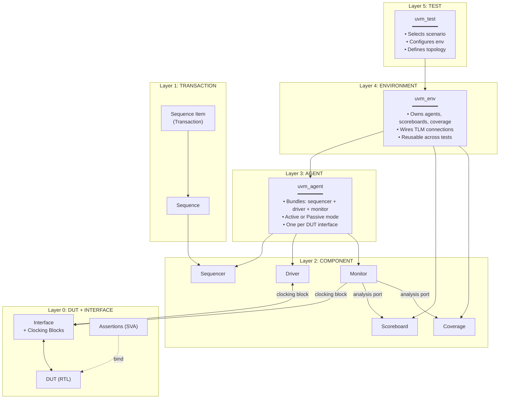
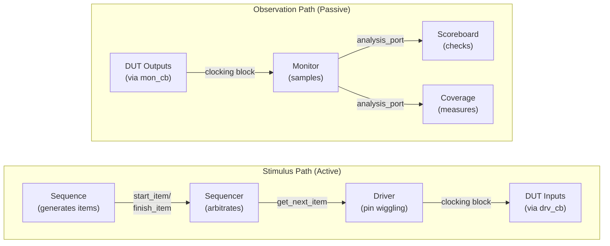
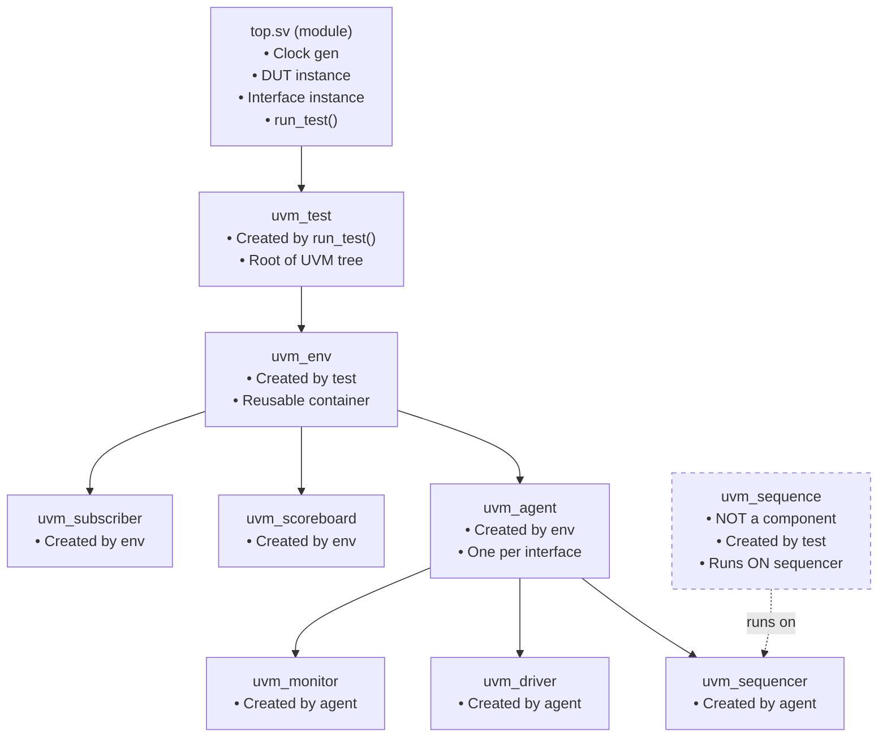
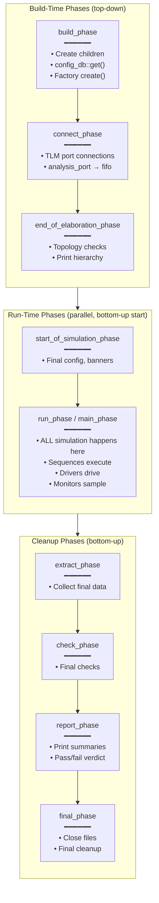
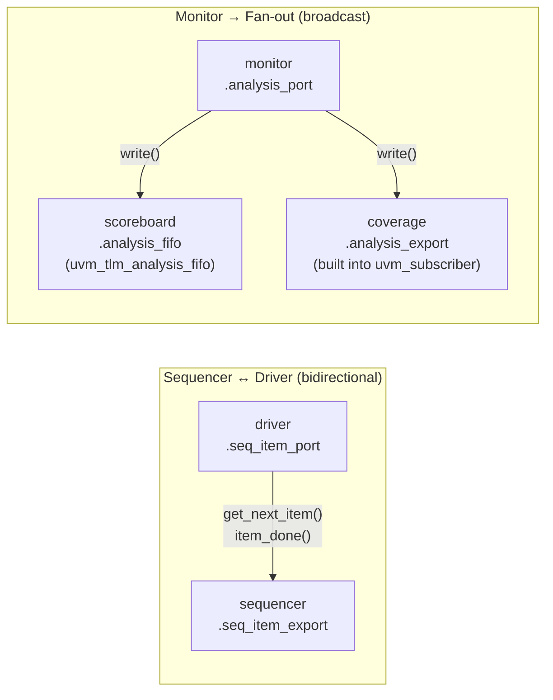
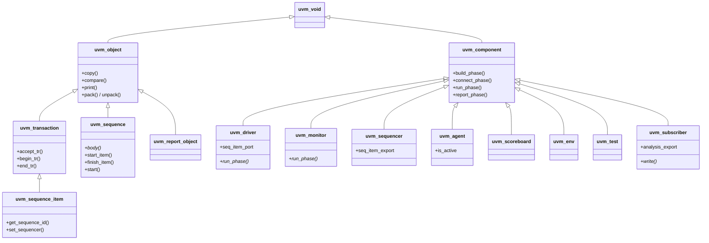

# 📘 UVM Complete Reference — Templates, Architecture & Deep Dive

> **Purpose:** Career-level reference for UVM verification — reusable across any project  
> **Audience:** Verification engineers (RTL → UVM → sign-off)  
> **Standard:** IEEE 1800.2-2020 (UVM), IEEE 1800-2017 (SystemVerilog)

---

# Part 1 — The Big Picture

## 1.1 UVM Layered Architecture



> [!IMPORTANT]
> **Read this diagram bottom-up.** The DUT is at the bottom. Each layer above adds abstraction. Tests sit at the top — they never touch DUT signals directly.

---

## 1.2 Data Flow — Stimulus vs Observation



> [!TIP]
> These two paths are **completely independent**. The driver never tells the monitor what it drove. The monitor observes the actual wire-level behavior. This independence is what catches RTL bugs.

---

## 1.3 UVM Component Ownership Tree



> [!NOTE]
> **Sequences are NOT components.** They are `uvm_object`s (transient), not `uvm_component`s (permanent). They are created by the test and run on the sequencer, but they don't live in the component hierarchy.

---

## 1.4 UVM Phase Execution Order



> [!IMPORTANT]
> **Build phases execute top-down** (test → env → agent → driver). **Cleanup phases execute bottom-up** (driver → agent → env → test). **Run phase is parallel** — all components' `run_phase` tasks execute concurrently as forked processes.

---

## 1.5 TLM Connection Map



> **Key insight:** The `analysis_port` is a **broadcast** — one write goes to ALL connected subscribers. You don't need a splitter. Just connect multiple subscribers to the same port.

---

## 1.6 `config_db` Flow — How the Virtual Interface Gets Passed

```mermaid
flowchart TD
    TOP["top.sv (module)\n━━━━━━━━\nuvm_config_db#(virtual fifo_if)::set(\nnull, \"*\", \"vif\", vif_inst)"]
    
    DRV["driver::build_phase\n━━━━━━━━\nuvm_config_db#(virtual fifo_if)::get(\nthis, \"\", \"vif\", vif)"]
    
    MON["monitor::build_phase\n━━━━━━━━\nuvm_config_db#(virtual fifo_if)::get(\nthis, \"\", \"vif\", vif)"]

    TOP -->|"set once"| DRV
    TOP -->|"same key"| MON
```

> [!TIP]
> **`set` in the module world, `get` in the class world.** The top module sets the virtual interface before `run_test()`. Every component that needs it calls `get` in its `build_phase`.

---

## 1.7 UVM Class Hierarchy (What Extends What)



> [!NOTE]
> **Two inheritance trees:** `uvm_object` (transient data: items, sequences, configs) and `uvm_component` (persistent hierarchy: driver, monitor, etc.). Components have phases, names, and parent-child relationships. Objects don't.

---

# Part 2 — Component Templates

> **Legend for each template:**
> - 🔴 **MUST HAVE** — Won't work without it
> - 🟡 **SHOULD HAVE** — Professional-grade, expected in industry
> - 🟢 **NICE TO HAVE** — Advanced, differentiates senior engineers

---

## Template 1: `uvm_sequence_item` — Transaction

The atomic unit of stimulus and response. Everything flows through this.

```systemverilog
class my_seq_item extends uvm_sequence_item;

  // ══════════════════════════════════════════════
  // 🔴 MUST: Factory registration
  // ══════════════════════════════════════════════
  `uvm_object_utils(my_seq_item)                  // NOT uvm_component_utils (items are objects)

  // ══════════════════════════════════════════════
  // 🔴 MUST: Randomizable stimulus fields
  // ══════════════════════════════════════════════
  rand bit        wr_en;
  rand bit        rd_en;
  rand bit [7:0]  data_in;

  // ══════════════════════════════════════════════
  // 🔴 MUST: Non-random response / observation fields
  // ══════════════════════════════════════════════
  bit [7:0]  data_out;                             // captured by monitor, NOT randomized
  bit        full;
  bit        empty;

  // ══════════════════════════════════════════════
  // 🟡 SHOULD: Default constraints
  // ══════════════════════════════════════════════
  constraint c_default_dist {
    wr_en dist {1 := 60, 0 := 40};                // write-biased for faster filling
    rd_en dist {1 := 40, 0 := 60};
  }

  constraint c_valid_data {
    // example: soft constraint, easily overridden
    soft data_in inside {[0:255]};
  }

  // ══════════════════════════════════════════════
  // 🔴 MUST: Constructor
  // ══════════════════════════════════════════════
  function new(string name = "my_seq_item");
    super.new(name);
  endfunction

  // ══════════════════════════════════════════════
  // 🟡 SHOULD: convert2string() — critical for debug
  // ══════════════════════════════════════════════
  // Called by `uvm_info, print(), sprint(). If you skip this, debug is painful.
  virtual function string convert2string();
    return $sformatf("wr=%0b rd=%0b din=0x%02h | dout=0x%02h full=%0b empty=%0b",
                     wr_en, rd_en, data_in, data_out, full, empty);
  endfunction

  // ══════════════════════════════════════════════
  // 🟡 SHOULD: do_copy() — deep copy
  // ══════════════════════════════════════════════
  // Required if you pass items through analysis ports (monitor → scoreboard).
  // Without this, you get aliased handles — scoreboard sees stale data.
  virtual function void do_copy(uvm_object rhs);
    my_seq_item rhs_;
    super.do_copy(rhs);
    if (!$cast(rhs_, rhs)) `uvm_fatal("CAST", "do_copy cast failed")
    this.wr_en   = rhs_.wr_en;
    this.rd_en   = rhs_.rd_en;
    this.data_in = rhs_.data_in;
    this.data_out = rhs_.data_out;
    this.full    = rhs_.full;
    this.empty   = rhs_.empty;
  endfunction

  // ══════════════════════════════════════════════
  // 🟡 SHOULD: do_compare() — field-by-field comparison
  // ══════════════════════════════════════════════
  virtual function bit do_compare(uvm_object rhs, uvm_comparer comparer);
    my_seq_item rhs_;
    if (!$cast(rhs_, rhs)) return 0;
    return (super.do_compare(rhs, comparer) &&
            this.data_out == rhs_.data_out &&
            this.full     == rhs_.full     &&
            this.empty    == rhs_.empty);
  endfunction

  // ══════════════════════════════════════════════
  // 🟢 NICE: do_print() — formatted table output
  // ══════════════════════════════════════════════
  virtual function void do_print(uvm_printer printer);
    super.do_print(printer);
    printer.print_field_int("wr_en",   wr_en,   1, UVM_BIN);
    printer.print_field_int("rd_en",   rd_en,   1, UVM_BIN);
    printer.print_field_int("data_in", data_in, 8, UVM_HEX);
    printer.print_field_int("data_out",data_out, 8, UVM_HEX);
    printer.print_field_int("full",    full,    1, UVM_BIN);
    printer.print_field_int("empty",   empty,   1, UVM_BIN);
  endfunction

endclass
```

**Alternative: Field Macros (quick but slower at scale)**
```systemverilog
// Replace do_copy/do_compare/do_print with:
`uvm_object_utils_begin(my_seq_item)
  `uvm_field_int(wr_en,   UVM_ALL_ON)
  `uvm_field_int(rd_en,   UVM_ALL_ON)
  `uvm_field_int(data_in, UVM_ALL_ON)
  `uvm_field_int(data_out, UVM_ALL_ON | UVM_NOCOMPARE)  // don't compare stimulus vs response
  `uvm_field_int(full,    UVM_ALL_ON | UVM_NOCOMPARE)
  `uvm_field_int(empty,   UVM_ALL_ON | UVM_NOCOMPARE)
`uvm_object_utils_end
```

**Common mistakes:**
| Mistake | Consequence | Fix |
|---------|------------|-----|
| Using `uvm_component_utils` | Item can't be created by factory for sequences | Use `uvm_object_utils` |
| Making response fields `rand` | Scoreboard compares randomized garbage | Only stimulus fields are `rand` |
| Forgetting `do_copy` | Monitor analysis port shares handle → scoreboard sees overwritten data | Always implement `do_copy` or use field macros |
| Hard constraints where soft is needed | Can't override in directed sequences | Use `soft` for defaults |

**Tips:**
- Use `convert2string()` religiously — it's the single most useful debug method
- `soft` constraints are overridable by inline `randomize() with {...}` in sequences
- Field macros generate `copy`, `compare`, `print`, `pack`, `unpack` automatically — convenient for prototyping, but manual methods give you control and are ~5× faster in simulation

---

## Template 2: `uvm_sequence` — Stimulus Generator

Generates a stream of transactions and sends them through the sequencer to the driver.

```systemverilog
class my_base_sequence extends uvm_sequence #(my_seq_item);

  // ══════════════════════════════════════════════
  // 🔴 MUST: Factory registration
  // ══════════════════════════════════════════════
  `uvm_object_utils(my_base_sequence)

  // ══════════════════════════════════════════════
  // 🟡 SHOULD: Configurable parameters
  // ══════════════════════════════════════════════
  int unsigned num_transactions = 100;

  // ══════════════════════════════════════════════
  // 🔴 MUST: Constructor
  // ══════════════════════════════════════════════
  function new(string name = "my_base_sequence");
    super.new(name);
  endfunction

  // ══════════════════════════════════════════════
  // 🔴 MUST: body() — the generation engine
  // ══════════════════════════════════════════════
  virtual task body();
    my_seq_item item;

    repeat (num_transactions) begin
      item = my_seq_item::type_id::create("item");  // factory create
      start_item(item);                               // request sequencer grant
      if (!item.randomize())                          // randomize BETWEEN start/finish
        `uvm_fatal("RAND", "Randomization failed")
      finish_item(item);                              // send to driver, block until done
    end
  endtask

endclass

// ──────────────────────────────────────────────────
// Directed sequence example (extends base)
// ──────────────────────────────────────────────────
class my_directed_sequence extends my_base_sequence;

  `uvm_object_utils(my_directed_sequence)

  function new(string name = "my_directed_sequence");
    super.new(name);
  endfunction

  virtual task body();
    my_seq_item item;

    // Phase 1: directed writes with specific values
    foreach ({8'hAA, 8'hBB, 8'hCC}[i]) begin
      item = my_seq_item::type_id::create("item");
      start_item(item);
      if (!item.randomize() with {
        wr_en == 1;
        rd_en == 0;
        data_in == {8'hAA, 8'hBB, 8'hCC}[i];       // inline constraint override
      }) `uvm_fatal("RAND", "Randomization failed")
      finish_item(item);
    end

    // Phase 2: read them back
    repeat (3) begin
      item = my_seq_item::type_id::create("item");
      start_item(item);
      if (!item.randomize() with { wr_en == 0; rd_en == 1; })
        `uvm_fatal("RAND", "Randomization failed")
      finish_item(item);
    end
  endtask

endclass
```

**Sequence execution protocol (the handshake):**
```
start_item(item)    →  Blocks until sequencer grants access
item.randomize()    →  Randomize AFTER getting grant (constraints may depend on DUT state)
finish_item(item)   →  Sends item to driver, blocks until driver calls item_done()
```

> [!IMPORTANT]
> **Randomize between `start_item` and `finish_item`.** If you randomize before `start_item`, the randomization happens before the sequencer grants access — you might miss state-dependent constraints. This order matters for reactive sequences.

**Common mistakes:**
| Mistake | Consequence | Fix |
|---------|------------|-----|
| `new` the item instead of factory `create` | Factory overrides won't work | Always use `type_id::create()` |
| Randomize before `start_item` | Misses response-based re-randomization | Randomize between start/finish |
| Not checking `randomize()` return | Silent constraint failures, `X` values driven | Always check: `if (!item.randomize()) \`uvm_fatal(...)` |
| Forgetting `super.body()` in child | Parent setup skipped | Call `super.body()` if parent has setup logic |

**Tips:**
- Use a **base sequence** with common parameters (`num_transactions`, reset behavior). All directed sequences extend it.
- For **virtual sequences** (multi-agent coordination), use `uvm_sequence #(uvm_sequence_item)` and start sub-sequences on specific sequencers via handles.
- `raise_objection` / `drop_objection` in the test or sequence controls when simulation ends. Without it, simulation exits immediately.

---

## Template 3: `uvm_sequencer` — Arbitrator

Usually a thin wrapper or typedef. Becomes important for multi-sequence arbitration.

```systemverilog
// ══════════════════════════════════════════════
// Option A: Simple typedef (most common)
// ══════════════════════════════════════════════
typedef uvm_sequencer #(my_seq_item) my_sequencer;

// ══════════════════════════════════════════════
// Option B: Class extension (when you need custom behavior)
// ══════════════════════════════════════════════
class my_sequencer extends uvm_sequencer #(my_seq_item);

  `uvm_component_utils(my_sequencer)                // NOW it's component_utils (lives in hierarchy)

  function new(string name = "my_sequencer", uvm_component parent = null);
    super.new(name, parent);
  endfunction

  // 🟢 NICE: Custom arbitration, RL action injection point, etc.

endclass
```

**When to use Option B:**
- You need to pass config to sequences via the sequencer
- RL agent needs to inject scenario selection (Phase 4 of your project)
- Multiple sequences need custom arbitration priority
- You need a handle to the sequencer for runtime reconfiguration

---

## Template 4: `uvm_driver` — Pin Wiggler

Converts abstract transactions into pin-level signal activity on the DUT.

```systemverilog
class my_driver extends uvm_driver #(my_seq_item);

  // ══════════════════════════════════════════════
  // 🔴 MUST: Factory registration
  // ══════════════════════════════════════════════
  `uvm_component_utils(my_driver)

  // ══════════════════════════════════════════════
  // 🔴 MUST: Virtual interface handle
  // ══════════════════════════════════════════════
  virtual my_if vif;

  // ══════════════════════════════════════════════
  // 🔴 MUST: Constructor (with parent)
  // ══════════════════════════════════════════════
  function new(string name = "my_driver", uvm_component parent = null);
    super.new(name, parent);
  endfunction

  // ══════════════════════════════════════════════
  // 🔴 MUST: build_phase — get virtual interface
  // ══════════════════════════════════════════════
  virtual function void build_phase(uvm_phase phase);
    super.build_phase(phase);
    if (!uvm_config_db #(virtual my_if)::get(this, "", "vif", vif))
      `uvm_fatal("NOVIF", "Virtual interface not found in config_db")
  endfunction

  // ══════════════════════════════════════════════
  // 🔴 MUST: run_phase — the drive loop
  // ══════════════════════════════════════════════
  virtual task run_phase(uvm_phase phase);
    my_seq_item item;

    // 🟡 SHOULD: Initial reset
    reset_dut();

    forever begin
      // ── Step 1: Get item from sequencer (blocks) ──
      seq_item_port.get_next_item(item);

      // ── Step 2: Drive signals onto DUT ──
      drive_item(item);

      // ── Step 3: Tell sequencer we're done ──
      seq_item_port.item_done();
    end
  endtask

  // ══════════════════════════════════════════════
  // 🟡 SHOULD: Separate reset task
  // ══════════════════════════════════════════════
  virtual task reset_dut();
    `uvm_info(get_type_name(), "Driving reset...", UVM_MEDIUM)
    vif.rst_n <= 1'b0;                             // direct drive, NOT through clocking block
    vif.drv_cb.wr_en   <= 1'b0;
    vif.drv_cb.rd_en   <= 1'b0;
    vif.drv_cb.data_in <= '0;
    repeat (5) @(posedge vif.clk);                 // hold reset for 5 cycles
    vif.rst_n <= 1'b1;
    @(posedge vif.clk);                            // wait 1 cycle after release
    `uvm_info(get_type_name(), "Reset released.", UVM_MEDIUM)
  endtask

  // ══════════════════════════════════════════════
  // 🟡 SHOULD: Separate drive task (clean separation)
  // ══════════════════════════════════════════════
  virtual task drive_item(my_seq_item item);
    @(vif.drv_cb);                                 // sync to clock edge
    vif.drv_cb.wr_en   <= item.wr_en;
    vif.drv_cb.rd_en   <= item.rd_en;
    vif.drv_cb.data_in <= item.data_in;
  endtask

  // ══════════════════════════════════════════════
  // 🟢 NICE: Reset detection mid-test (advanced)
  // ══════════════════════════════════════════════
  // Use fork-join_any to detect reset assertion during normal driving,
  // allowing driver to cleanly restart its protocol.

endclass
```

**The driver protocol in one picture:**
```
  Sequencer          Driver                DUT
     │                  │                   │
     │◄─get_next_item──│                   │
     │──item───────────►│                   │
     │                  │──drive signals───►│
     │                  │   @(clk)          │
     │◄──item_done──────│                   │
     │                  │                   │
     │  (repeat)        │                   │
```

**Common mistakes:**
| Mistake | Consequence | Fix |
|---------|------------|-----|
| Forgetting `item_done()` | Sequencer blocks forever, test hangs | Always call `item_done()` after driving |
| Driving reset through clocking block | Reset timing is off by skew amount | Drive `rst_n` directly: `vif.rst_n <= 0` |
| Missing `@(vif.drv_cb)` | Signals change asynchronously, race conditions | Always sync to clocking block edge before driving |
| No `super.build_phase(phase)` | UVM internal setup skipped | Always call `super.*_phase(phase)` |

**Tips:**
- The driver is **stupid on purpose** — it doesn't know what's correct. It just drives what the sequence tells it to.
- For multi-cycle protocols (AXI, APB), the `drive_item` task spans multiple clock cycles with a state machine.
- Keep `drive_item` as a separate task — makes it easy to swap protocols without rewriting the control loop.

---

## Template 5: `uvm_monitor` — Passive Observer

Observes DUT interface signals, packages into transactions, broadcasts to analysis components.

```systemverilog
class my_monitor extends uvm_monitor;

  // ══════════════════════════════════════════════
  // 🔴 MUST: Factory + analysis port
  // ══════════════════════════════════════════════
  `uvm_component_utils(my_monitor)
  uvm_analysis_port #(my_seq_item) analysis_port;  // broadcast to scoreboard + coverage

  // ══════════════════════════════════════════════
  // 🔴 MUST: Virtual interface
  // ══════════════════════════════════════════════
  virtual my_if vif;

  // ══════════════════════════════════════════════
  // 🔴 MUST: Constructor
  // ══════════════════════════════════════════════
  function new(string name = "my_monitor", uvm_component parent = null);
    super.new(name, parent);
  endfunction

  // ══════════════════════════════════════════════
  // 🔴 MUST: build_phase
  // ══════════════════════════════════════════════
  virtual function void build_phase(uvm_phase phase);
    super.build_phase(phase);
    analysis_port = new("analysis_port", this);    // create the port
    if (!uvm_config_db #(virtual my_if)::get(this, "", "vif", vif))
      `uvm_fatal("NOVIF", "Virtual interface not found")
  endfunction

  // ══════════════════════════════════════════════
  // 🔴 MUST: run_phase — sample and broadcast
  // ══════════════════════════════════════════════
  virtual task run_phase(uvm_phase phase);

    // 🟡 SHOULD: Wait for reset to complete before sampling
    wait (vif.rst_n === 1'b1);
    @(posedge vif.clk);

    forever begin
      my_seq_item item;
      item = my_seq_item::type_id::create("item");
      collect_transaction(item);
      analysis_port.write(item);                   // broadcast to all subscribers
    end
  endtask

  // ══════════════════════════════════════════════
  // 🟡 SHOULD: Separate collection task
  // ══════════════════════════════════════════════
  virtual task collect_transaction(my_seq_item item);
    @(vif.mon_cb);                                 // sync to monitoring clock edge
    item.wr_en   = vif.mon_cb.wr_en;
    item.rd_en   = vif.mon_cb.rd_en;
    item.data_in = vif.mon_cb.data_in;
    item.data_out = vif.mon_cb.data_out;
    item.full    = vif.mon_cb.full;
    item.empty   = vif.mon_cb.empty;
  endtask

  // ══════════════════════════════════════════════
  // 🟢 NICE: Reset-aware monitoring
  // ══════════════════════════════════════════════
  // Use fork-join_any: one thread monitors, other watches for
  // rst_n going low. On reset, cancel current collection,
  // emit a "reset" transaction so scoreboard can clear state.

endclass
```

**Common mistakes:**
| Mistake | Consequence | Fix |
|---------|------------|-----|
| Monitor drives signals | Breaks passive observation principle | Monitor ONLY reads, never writes |
| Not creating `analysis_port` | Null-pointer crash when `write()` is called | Create in `build_phase` |
| Sharing item handle across cycles | Scoreboard sees only last transaction (aliasing) | Create new item every cycle, or use `do_copy` |
| Not waiting for reset | Samples `X`/`Z` values during reset, floods scoreboard with garbage | Wait for `rst_n === 1` before main loop |

**Tips:**
- Create a **new item every clock cycle** (factory create inside the loop). This avoids handle aliasing.
- For multi-cycle protocols, the monitor has a state machine that assembles a full transaction across multiple cycles.
- Consider emitting a special "reset event" transaction when reset is detected — this lets the scoreboard reset its state cleanly.

---

## Template 6: `uvm_agent` — Component Bundle

Groups sequencer + driver + monitor. Supports active (drives stimulus) and passive (monitor-only) modes.

```systemverilog
class my_agent extends uvm_agent;

  // ══════════════════════════════════════════════
  // 🔴 MUST: Factory + component handles
  // ══════════════════════════════════════════════
  `uvm_component_utils(my_agent)

  my_sequencer  sequencer;                         // only in ACTIVE mode
  my_driver     driver;                            // only in ACTIVE mode
  my_monitor    monitor;                           // ALWAYS present

  // ══════════════════════════════════════════════
  // 🔴 MUST: Constructor
  // ══════════════════════════════════════════════
  function new(string name = "my_agent", uvm_component parent = null);
    super.new(name, parent);
  endfunction

  // ══════════════════════════════════════════════
  // 🔴 MUST: build_phase — create children
  // ══════════════════════════════════════════════
  virtual function void build_phase(uvm_phase phase);
    super.build_phase(phase);

    // Monitor is ALWAYS created
    monitor = my_monitor::type_id::create("monitor", this);

    // Sequencer + driver only in active mode
    if (get_is_active() == UVM_ACTIVE) begin
      sequencer = my_sequencer::type_id::create("sequencer", this);
      driver    = my_driver::type_id::create("driver", this);
    end
  endfunction

  // ══════════════════════════════════════════════
  // 🔴 MUST: connect_phase — wire TLM ports
  // ══════════════════════════════════════════════
  virtual function void connect_phase(uvm_phase phase);
    super.connect_phase(phase);

    if (get_is_active() == UVM_ACTIVE) begin
      driver.seq_item_port.connect(sequencer.seq_item_export);
    end
    // NOTE: monitor.analysis_port is connected in the ENVIRONMENT, not here
  endfunction

endclass
```

**Active vs Passive:**
| Mode | Components | Use case |
|------|-----------|----------|
| `UVM_ACTIVE` | Sequencer + Driver + Monitor | Primary interface — you're driving stimulus |
| `UVM_PASSIVE` | Monitor only | Secondary interface — just observing (e.g., output port of a bridge DUT) |

**Tips:**
- Set active/passive from the test: `uvm_config_db#(uvm_active_passive_enum)::set(this, "env.agent", "is_active", UVM_PASSIVE);`
- One agent per DUT interface. Multi-interface DUTs get multiple agents, coordinated by a **virtual sequencer** in the env.

---

## Template 7: `uvm_scoreboard` — Checker + Reference Model

Compares expected vs actual DUT behavior. The heart of self-checking.

```systemverilog
class my_scoreboard extends uvm_scoreboard;

  // ══════════════════════════════════════════════
  // 🔴 MUST: Factory + TLM analysis FIFO
  // ══════════════════════════════════════════════
  `uvm_component_utils(my_scoreboard)
  uvm_tlm_analysis_fifo #(my_seq_item) analysis_fifo;  // receives from monitor

  // ══════════════════════════════════════════════
  // 🔴 MUST: Reference model state
  // ══════════════════════════════════════════════
  // For a FIFO DUT, this is a queue. For other DUTs, this is your golden model.
  bit [7:0] ref_queue[$];

  // ══════════════════════════════════════════════
  // 🟡 SHOULD: Counters for reporting
  // ══════════════════════════════════════════════
  int unsigned match_count    = 0;
  int unsigned mismatch_count = 0;
  int unsigned total_count    = 0;

  // ══════════════════════════════════════════════
  // 🔴 MUST: Constructor
  // ══════════════════════════════════════════════
  function new(string name = "my_scoreboard", uvm_component parent = null);
    super.new(name, parent);
  endfunction

  // ══════════════════════════════════════════════
  // 🔴 MUST: build_phase
  // ══════════════════════════════════════════════
  virtual function void build_phase(uvm_phase phase);
    super.build_phase(phase);
    analysis_fifo = new("analysis_fifo", this);
  endfunction

  // ══════════════════════════════════════════════
  // 🔴 MUST: run_phase — comparison engine
  // ══════════════════════════════════════════════
  virtual task run_phase(uvm_phase phase);
    my_seq_item item;

    forever begin
      analysis_fifo.get(item);                     // blocking — waits for monitor data
      compare(item);
    end
  endtask

  // ══════════════════════════════════════════════
  // 🔴 MUST: Comparison logic (DUT-specific)
  // ══════════════════════════════════════════════
  virtual function void compare(my_seq_item item);
    // This is where YOUR reference model lives.
    // Compare item.actual_output vs expected_output.
    //
    // For a FIFO:
    //   if valid_write: ref_queue.push_back(item.data_in)
    //   if valid_read:  expected = ref_queue.pop_front(); compare with item.data_out
    //
    // Handle 1-cycle latency for registered outputs!
    total_count++;
  endfunction

  // ══════════════════════════════════════════════
  // 🟡 SHOULD: report_phase — final verdict
  // ══════════════════════════════════════════════
  virtual function void report_phase(uvm_phase phase);
    super.report_phase(phase);
    `uvm_info(get_type_name(), $sformatf(
      "\n══════════════════════════════════════\n  SCOREBOARD SUMMARY\n  Total:      %0d\n  Matches:    %0d\n  Mismatches: %0d\n  Status:     %s\n══════════════════════════════════════",
      total_count, match_count, mismatch_count,
      (mismatch_count == 0) ? "✅ PASS" : "❌ FAIL"), UVM_LOW)
  endfunction

endclass
```

**Two patterns for receiving data:**

| Pattern | Mechanism | When to use |
|---------|----------|-------------|
| **`uvm_tlm_analysis_fifo`** | `analysis_fifo.get(item)` in `run_phase` — blocking | When scoreboard needs to process items sequentially, at its own pace |
| **`uvm_subscriber`** | `write(item)` callback — non-blocking | When scoreboard processes each item immediately on arrival |

> [!TIP]
> The `analysis_fifo` pattern is more flexible — it decouples the monitor's write timing from the scoreboard's processing. Use it as your default.

**Tips:**
- The **reference model** is the most important part. Get this right and everything else follows.
- For registered outputs (1-cycle latency), maintain a pending-comparison pipeline. Don't compare `data_out` on the same cycle as `rd_en` — compare on the next.
- Log mismatches with `uvm_error` (not `uvm_fatal`) so the test continues and you see ALL failures, not just the first.

---

## Template 8: `uvm_subscriber` / Coverage Collector

Receives transactions and samples covergroups.

```systemverilog
class my_coverage extends uvm_subscriber #(my_seq_item);

  // ══════════════════════════════════════════════
  // 🔴 MUST: Factory
  // ══════════════════════════════════════════════
  `uvm_component_utils(my_coverage)

  // ══════════════════════════════════════════════
  // 🟡 SHOULD: Transaction handle for covergroup sampling
  // ══════════════════════════════════════════════
  my_seq_item item;

  // ══════════════════════════════════════════════
  // 🔴 MUST: Covergroup definition
  // ══════════════════════════════════════════════
  covergroup my_cg;
    // Individual coverpoints
    cp_wr_en: coverpoint item.wr_en {
      bins active   = {1};
      bins inactive = {0};
    }

    cp_rd_en: coverpoint item.rd_en {
      bins active   = {1};
      bins inactive = {0};
    }

    // Cross coverage
    cx_wr_rd: cross cp_wr_en, cp_rd_en;

    cp_data_in: coverpoint item.data_in {
      bins zero     = {0};
      bins low      = {[1:127]};
      bins high     = {[128:254]};
      bins max_val  = {255};
    }

    // 🟡 SHOULD: Transition coverage
    cp_full_trans: coverpoint item.full {
      bins rise = (0 => 1);
      bins fall = (1 => 0);
    }

    cp_empty_trans: coverpoint item.empty {
      bins rise = (0 => 1);
      bins fall = (1 => 0);
    }

    // 🟢 NICE: Illegal bins (things that should NEVER happen)
    cp_full_empty: coverpoint {item.full, item.empty} {
      illegal_bins both_high = {2'b11};            // full && empty simultaneously
    }

  endgroup

  // ══════════════════════════════════════════════
  // 🔴 MUST: Constructor — instantiate covergroup
  // ══════════════════════════════════════════════
  function new(string name = "my_coverage", uvm_component parent = null);
    super.new(name, parent);
    my_cg = new();                                 // covergroup must be newed in constructor
  endfunction

  // ══════════════════════════════════════════════
  // 🔴 MUST: write() — called automatically by analysis port
  // ══════════════════════════════════════════════
  virtual function void write(my_seq_item t);
    item = t;                                      // store handle for covergroup sampling
    my_cg.sample();                                // sample all coverpoints
  endfunction

  // ══════════════════════════════════════════════
  // 🟡 SHOULD: report_phase — coverage summary
  // ══════════════════════════════════════════════
  virtual function void report_phase(uvm_phase phase);
    super.report_phase(phase);
    `uvm_info(get_type_name(), $sformatf("Coverage: %.1f%%", my_cg.get_coverage()), UVM_LOW)
  endfunction

endclass
```

**`uvm_subscriber` vs manual analysis_fifo for coverage:**

| Approach | Mechanism | Best for |
|----------|----------|---------|
| `uvm_subscriber` | Built-in `write()` callback | Coverage (simple, one-shot sampling per transaction) |
| `uvm_tlm_analysis_fifo` | `get()` in `run_phase` | Scoreboard (sequential processing, state-dependent comparison) |

**Tips:**
- **Covergroup must be `new()`'d in the constructor**, not in `build_phase`. This is a SystemVerilog language requirement.
- Use `option.per_instance = 1` in the covergroup for per-instance coverage tracking.
- Use `illegal_bins` for states that should never be reached — this turns a coverage miss into an assertion-like check.
- `ignore_bins` for states that are unreachable by design — removes them from the coverage denominator.

---

## Template 9: `uvm_env` — Environment Container

Creates and wires all verification components.

```systemverilog
class my_env extends uvm_env;

  // ══════════════════════════════════════════════
  // 🔴 MUST: Factory + component handles
  // ══════════════════════════════════════════════
  `uvm_component_utils(my_env)

  my_agent       agent;
  my_scoreboard  scoreboard;
  my_coverage    coverage;

  // 🟢 NICE: Multiple agents for multi-interface DUTs
  // my_agent  agent_axi;
  // my_agent  agent_apb;
  // my_virtual_sequencer  v_seqr;

  // ══════════════════════════════════════════════
  // 🔴 MUST: Constructor
  // ══════════════════════════════════════════════
  function new(string name = "my_env", uvm_component parent = null);
    super.new(name, parent);
  endfunction

  // ══════════════════════════════════════════════
  // 🔴 MUST: build_phase — create all children
  // ══════════════════════════════════════════════
  virtual function void build_phase(uvm_phase phase);
    super.build_phase(phase);
    agent      = my_agent::type_id::create("agent", this);
    scoreboard = my_scoreboard::type_id::create("scoreboard", this);
    coverage   = my_coverage::type_id::create("coverage", this);
  endfunction

  // ══════════════════════════════════════════════
  // 🔴 MUST: connect_phase — wire TLM ports
  // ══════════════════════════════════════════════
  virtual function void connect_phase(uvm_phase phase);
    super.connect_phase(phase);

    // Monitor → Scoreboard (via analysis_fifo)
    agent.monitor.analysis_port.connect(scoreboard.analysis_fifo.analysis_export);

    // Monitor → Coverage (via subscriber's built-in export)
    agent.monitor.analysis_port.connect(coverage.analysis_export);
  endfunction

endclass
```

**Tips:**
- The env is **reusable** — different tests create the same env but start different sequences.
- For multi-agent systems, the env owns a **virtual sequencer** that coordinates sequences across agents.
- The env is the natural place for **register model (RAL)** integration if you need register access.

---

## Template 10: `uvm_test` — Top-Level Orchestrator

Configures everything and starts the right sequence.

```systemverilog
// ──────────────────────────────────────────────────
// Base test — common setup for all tests
// ──────────────────────────────────────────────────
class my_base_test extends uvm_test;

  `uvm_component_utils(my_base_test)

  my_env env;

  function new(string name = "my_base_test", uvm_component parent = null);
    super.new(name, parent);
  endfunction

  // ══════════════════════════════════════════════
  // 🔴 MUST: build_phase — create environment
  // ══════════════════════════════════════════════
  virtual function void build_phase(uvm_phase phase);
    super.build_phase(phase);
    env = my_env::type_id::create("env", this);

    // 🟡 SHOULD: Configuration via config_db
    // uvm_config_db#(int)::set(this, "env.agent", "num_transactions", 1000);
  endfunction

  // ══════════════════════════════════════════════
  // 🟡 SHOULD: end_of_elaboration_phase — print topology
  // ══════════════════════════════════════════════
  virtual function void end_of_elaboration_phase(uvm_phase phase);
    super.end_of_elaboration_phase(phase);
    uvm_top.print_topology();                      // prints full component tree
  endfunction

  // ══════════════════════════════════════════════
  // 🟡 SHOULD: report_phase — final test result
  // ══════════════════════════════════════════════
  virtual function void report_phase(uvm_phase phase);
    uvm_report_server svr;
    super.report_phase(phase);
    svr = uvm_report_server::get_server();
    if (svr.get_severity_count(UVM_ERROR) + svr.get_severity_count(UVM_FATAL) > 0)
      `uvm_info(get_type_name(), "═══ TEST FAILED ═══", UVM_NONE)
    else
      `uvm_info(get_type_name(), "═══ TEST PASSED ═══", UVM_NONE)
  endfunction

endclass

// ──────────────────────────────────────────────────
// Specific test — extends base, starts a sequence
// ──────────────────────────────────────────────────
class my_random_test extends my_base_test;

  `uvm_component_utils(my_random_test)

  function new(string name = "my_random_test", uvm_component parent = null);
    super.new(name, parent);
  endfunction

  // ══════════════════════════════════════════════
  // 🔴 MUST: run_phase — start the sequence
  // ══════════════════════════════════════════════
  virtual task run_phase(uvm_phase phase);
    my_base_sequence seq;

    // 🔴 MUST: Raise objection to keep simulation running
    phase.raise_objection(this, "Starting test sequence");

    seq = my_base_sequence::type_id::create("seq");
    seq.num_transactions = 2000;
    seq.start(env.agent.sequencer);                // start sequence on sequencer

    // 🔴 MUST: Drop objection when sequence is done
    phase.drop_objection(this, "Test sequence complete");
  endtask

endclass
```

**Objection mechanism — why simulation doesn't end immediately:**
```
raise_objection ──► simulation stays alive ──► drop_objection ──► simulation ends
```

> [!IMPORTANT]
> **If you forget `raise_objection`, the simulation exits at time 0.** If you forget `drop_objection`, the simulation hangs forever (or until timeout). Always pair them.

**Test selection at runtime:**
```bash
vsim +UVM_TESTNAME=my_random_test    # selects which test class to instantiate
```

**Tips:**
- Each test class = one scenario. The test is tiny — all it does is configure the env and start a sequence.
- Use a `my_base_test` with common setup (env creation, topology print, pass/fail reporting). Specific tests extend it.
- `uvm_top.print_topology()` in `end_of_elaboration_phase` is invaluable for debugging hierarchy issues.

---

## Template 11: Interface + Clocking Blocks

Not a UVM class — a SystemVerilog construct that bundles DUT signals.

```systemverilog
interface my_if (input logic clk);

  // ══════════════════════════════════════════════
  // 🔴 MUST: All DUT signals
  // ══════════════════════════════════════════════
  logic        rst_n;
  logic        wr_en;
  logic        rd_en;
  logic [7:0]  data_in;
  logic [7:0]  data_out;
  logic        full;
  logic        empty;

  // ══════════════════════════════════════════════
  // 🟡 SHOULD: Driver clocking block
  // ══════════════════════════════════════════════
  // Defines WHEN and HOW the driver accesses signals.
  // Output skew (#1ns) ensures signals settle after clock edge.
  // Input skew  (#1ns) samples signals just before clock edge.
  clocking drv_cb @(posedge clk);
    default input #1ns output #1ns;
    output wr_en, rd_en, data_in;                  // driver WRITES these
    input  full, empty, data_out;                  // driver READS these (for response)
  endclocking

  // ══════════════════════════════════════════════
  // 🟡 SHOULD: Monitor clocking block
  // ══════════════════════════════════════════════
  // All signals are inputs — monitor is passive.
  clocking mon_cb @(posedge clk);
    default input #1ns;
    input wr_en, rd_en, data_in, data_out, full, empty, rst_n;
  endclocking

  // ══════════════════════════════════════════════
  // 🟡 SHOULD: Modports — restrict access
  // ══════════════════════════════════════════════
  modport DRV (
    clocking drv_cb,
    output rst_n                                   // reset driven directly, not through CB
  );

  modport MON (
    clocking mon_cb
  );

  // ══════════════════════════════════════════════
  // 🟢 NICE: Assertions inside interface
  // ══════════════════════════════════════════════
  // Interface-level protocol assertions can live here.
  // DUT-internal assertions go in a separate bind module.

endinterface
```

**Why clocking blocks matter:**
```
Without CB:  Signal change and clock edge race → non-deterministic simulation
With CB:     Output skew delays signal change AFTER edge
             Input skew samples signal BEFORE edge
             → Deterministic, race-free
```

**Tips:**
- `rst_n` goes in the modport as `output`, not in the clocking block. Reset is an immediate control signal — you don't want clock-edge synchronization delay on it.
- Monitor clocking block has **no output skew** — it only reads.
- The interface is a MODULE-level construct (not a class). It lives in the `top.sv` world.

---

## Template 12: SVA Assertions (Bind Module)

Concurrent assertions that check DUT behavior every clock cycle.

```systemverilog
module my_sva #(
  parameter int DATA_WIDTH = 8,
  parameter int DEPTH = 32
)(
  // ══════════════════════════════════════════════
  // 🔴 MUST: All signals needed by assertions
  // ══════════════════════════════════════════════
  input logic                    clk,
  input logic                    rst_n,
  input logic                    wr_en,
  input logic                    rd_en,
  input logic [DATA_WIDTH-1:0]   data_in,
  input logic [DATA_WIDTH-1:0]   data_out,
  input logic                    full,
  input logic                    empty,
  // Internal signals (accessible via bind)
  input logic [$clog2(DEPTH)-1:0] wr_ptr,
  input logic [$clog2(DEPTH)-1:0] rd_ptr,
  input logic [$clog2(DEPTH):0]   count
);

  // ══════════════════════════════════════════════
  // 🟡 SHOULD: Default clocking and disable
  // ══════════════════════════════════════════════
  default clocking cb @(posedge clk); endclocking
  default disable iff (!rst_n);                    // suppress during reset

  // ══════════════════════════════════════════════
  // 🔴 MUST: Property definitions + assertions
  // ══════════════════════════════════════════════

  // --- Safety properties (must ALWAYS hold) ---

  property p_count_bounds;
    count <= DEPTH;
  endproperty
  a_count_bounds: assert property (p_count_bounds)
    else `uvm_error("SVA", $sformatf("Count out of bounds: %0d", count))

  property p_full_empty_mutex;
    !(full && empty);
  endproperty
  a_full_empty_mutex: assert property (p_full_empty_mutex)
    else `uvm_error("SVA", "Full and empty both asserted!")

  // --- Equivalence properties ---

  property p_full_iff_depth;
    full == (count == DEPTH);
  endproperty
  a_full_iff_depth: assert property (p_full_iff_depth)
    else `uvm_error("SVA", $sformatf("Full flag mismatch: full=%b count=%0d", full, count))

  // --- Temporal properties (sequences of events) ---

  property p_stable_wr_ptr_when_full;
    full |=> $stable(wr_ptr) || !full;
  endproperty
  a_stable_wr_ptr_when_full: assert property (p_stable_wr_ptr_when_full)
    else `uvm_error("SVA", "wr_ptr changed while full!")

  // ══════════════════════════════════════════════
  // 🟡 SHOULD: Cover properties (for coverage)
  // ══════════════════════════════════════════════
  c_full_reached:  cover property (full);
  c_empty_reached: cover property (empty);
  c_simul_rw:      cover property (wr_en && rd_en && !full && !empty);

endmodule
```

**Bind statement (goes in `top.sv`):**
```systemverilog
bind sync_fifo my_sva #(.DATA_WIDTH(DATA_WIDTH), .DEPTH(DEPTH)) sva_inst (.*);
```

> [!TIP]
> **`bind` lets you add assertions WITHOUT modifying the RTL.** The `(.*)` connects all matching port names automatically. The assertion module "sees" internal DUT signals as if it were instantiated inside.

**Tips:**
- `property` + `assert property` is the standard pattern. Define the property separately so you can reuse it in `cover property` too.
- `disable iff (!rst_n)` — suppress all assertions during reset. Without this, you'll get false failures during reset.
- Use `$stable()`, `$rose()`, `$fell()`, `$past()` for temporal checks.
- `cover property` generates functional coverage from SVA — useful for tracking whether complex temporal scenarios were exercised.

---

## Template 13: `fifo_pkg.sv` — Package

Bundles all class includes in the correct dependency order.

```systemverilog
package my_pkg;
  // ══════════════════════════════════════════════
  // 🔴 MUST: Import UVM
  // ══════════════════════════════════════════════
  import uvm_pkg::*;
  `include "uvm_macros.svh"

  // ══════════════════════════════════════════════
  // 🔴 MUST: Include classes in dependency order
  // ══════════════════════════════════════════════
  `include "my_seq_item.sv"        // 1. no dependencies
  `include "my_sequence.sv"        // 2. depends on seq_item
  `include "my_sequencer.sv"       // 3. depends on seq_item
  `include "my_driver.sv"          // 4. depends on seq_item
  `include "my_monitor.sv"         // 5. depends on seq_item
  `include "my_agent.sv"           // 6. depends on drv + mon + seqr
  `include "my_scoreboard.sv"      // 7. depends on seq_item
  `include "my_coverage.sv"        // 8. depends on seq_item
  `include "my_env.sv"             // 9. depends on agent + scb + cov
  `include "my_test.sv"            // 10. depends on env + sequences
endpackage
```

> [!IMPORTANT]
> **Include order matters.** Each file depends on the ones above it. If you include `my_driver.sv` before `my_seq_item.sv`, compilation fails because the driver references the seq_item type.

---

## Template 14: `top.sv` — Simulation Top Module

The entry point — connects the module world to the class world.

```systemverilog
module top;
  import uvm_pkg::*;
  import my_pkg::*;
  `include "uvm_macros.svh"

  // ══════════════════════════════════════════════
  // 🔴 MUST: Clock generation
  // ══════════════════════════════════════════════
  logic clk;
  initial clk = 0;
  always #5 clk = ~clk;                           // 100 MHz, 10ns period

  // ══════════════════════════════════════════════
  // 🔴 MUST: Interface instantiation
  // ══════════════════════════════════════════════
  my_if vif(.clk(clk));

  // ══════════════════════════════════════════════
  // 🔴 MUST: DUT instantiation
  // ══════════════════════════════════════════════
  sync_fifo #(
    .DATA_WIDTH(8),
    .DEPTH(32)
  ) dut (
    .clk      (clk),
    .rst_n    (vif.rst_n),
    .wr_en    (vif.wr_en),
    .rd_en    (vif.rd_en),
    .data_in  (vif.data_in),
    .data_out (vif.data_out),
    .full     (vif.full),
    .empty    (vif.empty)
  );

  // ══════════════════════════════════════════════
  // 🟡 SHOULD: Bind assertions
  // ══════════════════════════════════════════════
  bind sync_fifo my_sva #(
    .DATA_WIDTH(DATA_WIDTH),
    .DEPTH(DEPTH)
  ) sva_inst (.*);

  // ══════════════════════════════════════════════
  // 🔴 MUST: Pass interface to UVM world
  // ══════════════════════════════════════════════
  initial begin
    uvm_config_db #(virtual my_if)::set(null, "*", "vif", vif);
    run_test();                                    // test selected by +UVM_TESTNAME
  end

  // ══════════════════════════════════════════════
  // 🟡 SHOULD: Timeout watchdog
  // ══════════════════════════════════════════════
  initial begin
    #1_000_000ns;                                  // 1ms timeout
    `uvm_fatal("TIMEOUT", "Simulation exceeded time limit")
  end

  // ══════════════════════════════════════════════
  // 🟢 NICE: Waveform dump
  // ══════════════════════════════════════════════
  initial begin
    $dumpfile("dump.vcd");
    $dumpvars(0, top);
  end

endmodule
```

**The bridge between two worlds:**
```
MODULE WORLD                          CLASS WORLD
─────────────────                     ─────────────────
top.sv (module)                       uvm_test (class)
  clock generator                       env
  interface instance ──config_db──►       agent
  DUT instance                              driver (gets vif)
  bind assertions                           monitor (gets vif)
  run_test()                              scoreboard
                                          coverage
```

---

# Part 3 — Pro Tips & Industry Patterns

## Reporting Verbosity Levels

```
UVM_NONE    → Always printed (test pass/fail)
UVM_LOW     → Key milestones (reset done, sequence started)
UVM_MEDIUM  → Transaction-level info (default)
UVM_HIGH    → Detailed per-cycle info
UVM_FULL    → Everything (debugging only)
UVM_DEBUG   → Internal UVM debugging
```

**Runtime control:** `+UVM_VERBOSITY=UVM_HIGH`

---

## Factory Override Patterns

```systemverilog
// In test — replace base sequence with directed sequence
// ALL create() calls that would make my_base_sequence now make my_directed_sequence
set_type_override_by_type(my_base_sequence::get_type(), my_directed_sequence::get_type());

// Instance-specific override (only for a specific path)
set_inst_override_by_type("env.agent.sequencer.*",
                          my_base_sequence::get_type(), my_directed_sequence::get_type());
```

> [!TIP]
> **Factory overrides are the UVM superpower.** They let you swap any component or transaction type without changing the code that creates it. This is why you always use `type_id::create()` instead of `new`.

---

## Objection Best Practices

| Pattern | Where | When |
|---------|-------|------|
| Raise in test, drop in test | `run_phase` of test class | Standard — test controls simulation lifetime |
| Raise in sequence, drop in sequence | `body()` of sequence | When sequence is started from test `run_phase` |
| Drain time | `phase.phase_done.set_drain_time(this, 100ns)` | Allow pipeline to flush after last transaction |

> [!WARNING]
> **Never raise/drop in driver or monitor.** These run forever — they'd never drop the objection, or they'd drop it prematurely.

---

## The Mental Model

```
┌──────────────────────────────────────────────────────────┐
│                    Think of UVM as:                       │
│                                                          │
│  SEQUENCE    = "What to test"    (test intent)           │
│  DRIVER      = "How to drive"   (protocol)               │
│  MONITOR     = "What happened"  (observation)            │
│  SCOREBOARD  = "Was it right?"  (checking)               │
│  COVERAGE    = "What's left?"   (completeness)           │
│  AGENT       = "Package deal"   (reusable bundle)        │
│  ENV         = "The lab bench"  (everything assembled)   │
│  TEST        = "Today's experiment" (specific scenario)  │
│                                                          │
│  INTERFACE   = "The cables"     (signal wiring)          │
│  CONFIG_DB   = "The label maker"(passing info around)    │
│  FACTORY     = "The 3D printer" (creating + swapping)    │
│  PHASES      = "The schedule"   (build → run → report)   │
│  TLM PORTS   = "The pneumatic tubes" (data transport)    │
└──────────────────────────────────────────────────────────┘
```

---

## Common Compilation & Simulation Errors

| Error | Likely cause | Fix |
|-------|-------------|-----|
| `Virtual interface not found` | `config_db::set` not called before `run_test()`, or key mismatch | Check `set` key matches `get` key exactly |
| `No UVM_TESTNAME specified` | Missing `+UVM_TESTNAME=...` on command line | Add to simulation command |
| `Factory create returned null` | Wrong type name or missing factory registration | Check `uvm_object_utils` / `uvm_component_utils` |
| Simulation exits at time 0 | Missing `raise_objection` | Add objection in test or sequence |
| Sequencer hangs | Missing `item_done()` in driver | Always pair `get_next_item` with `item_done` |
| Scoreboard sees same data every cycle | Monitor reuses same item handle (aliasing) | Create new item each cycle in monitor |
| Assertions fire during reset | Missing `disable iff (!rst_n)` | Add to all concurrent assertions |
| Wrong compilation order | Package included after files that need it | Follow the dependency order in `fifo_pkg.sv` |
